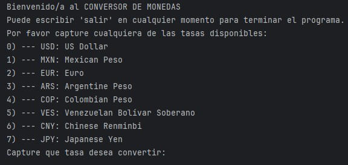
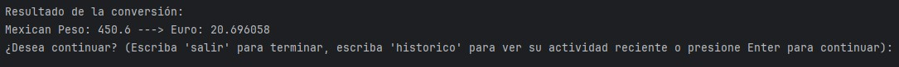
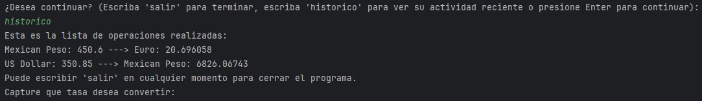
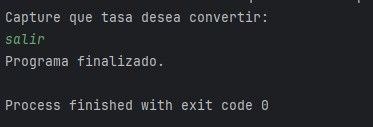

# 💱 Conversor de Monedas

Este proyecto es una aplicación simple que permite convertir valores entre diferentes monedas utilizando tasas de cambio actualizadas.

---

## 📋 Tabla de contenido

- [Descripción](#-descripción)
- [Características](#-características)
- [Tecnologías utilizadas](#-tecnologías-utilizadas)
- [Ejemplo de ejecución](#-ejemplo-de-ejecución)
- [Consideraciones Importantes](#-consideraciones-importantes)
- [Posibles Mejores](#-posibles-mejoras)
- [Créditos](#-créditos)


---

## 📝 Descripción

El conversor de monedas toma una cantidad ingresada 
por el usuario y la convierte de una moneda origen a una moneda destino. 
Utiliza una API de tasas de cambio en tiempo real que permite obtener la información mas reciente.

---

## ✨ Características

- Conversión entre múltiples monedas.
- Tasas actualizadas automáticamente.
- Validaciones de entrada de datos.

---

## 🧰 Tecnologías utilizadas
- Java 23
- Requests (para consultar la API de tasas)
- JSON (para consultar y guardar tasas)

---

## 💻 Ejemplo de Ejecución
Durante la ejecución es posible seleccionar los dos tipos de cambio a los que se desea convertir. La aplicacion mostrará
el siguiente listado y mensaje al iniciar:



En cada interacción el usuario podrá ir seleccionando las monedas de las que desea hacer conversión. Esta seleccion
se implementa haciendo uso de numeros enteros, es decir que se podra elegir tasa capturando el numero que le corresponde, como se ve en
el siguiente ejemplo:


Una vez presionado Enter, el usuario podra capturar el monto que desea convertir con lo que recibirá el siguiente resultado:



Tras recibir la opcion, se podrá imprimir el historico de las operaciones realizadas. Esta informacion estará disponible cuando se presente la opcion y por lo que dure la ejecución del programa.
Ejemplo de resultado:



Se podra escribir 'salir' en cualquier momento finalizar el programa.



---

## 📌 Consideraciones Importantes

Esta aplicación hace uso del API proporcionado por la página [Exchange Rate API](https://www.exchangerate-api.com/docs/standard-requests). Pero la clave API se maneja por separado en un archivo `config.properties` que esta 
incluido en un `.gitignore`.
Por lo que es necesario capturar nuevamente la API que se desea utilizar. Esto se puede hacer con cualquiera de estas dos maneras:

- Configurando un archivo `/config.properties` en la carpeta inicial del proyecto y agregar a la clave `API_KEY` la información de la clave del usuario.

>config.properties
>>API_KEY="Capturar la nueva clave API aqui"

- Modificando el metodo `connectionFile()` de la clase `ConversorAPI()`. En el manejo de excepciones es posible capturar una nueva API que reemplace a
la configurada en caso de que no se encuentre el archivo `config.properties`.
```
public class ConversorAPI { ...

public String connectionFile() {
        Properties properties = new Properties();

        try {
            FileInputStream fileConfig = new FileInputStream("config.properties");
            properties.load(fileConfig);
            return properties.getProperty("API_KEY");
        } catch (IOException ex) {
            System.out.println(ex.getMessage());
            System.out.println("Capturar una nueva API");
            return "Cambiar API Nueva Aqui";

        }
    ...
    }          
```
Cualquiera de estas dos opciones funcionará correctamente para implementar una nueva API.

---

## 🚀 Posibles Mejoras
- Implementación de Intefaz Grafica
- Mejora de Manejo de Excepciones
- Agregar monedas disponibles del mismo API
- Implementar nuevas API's


## 👨‍💻 Créditos
Abisai Hernandez - Desarrollador
